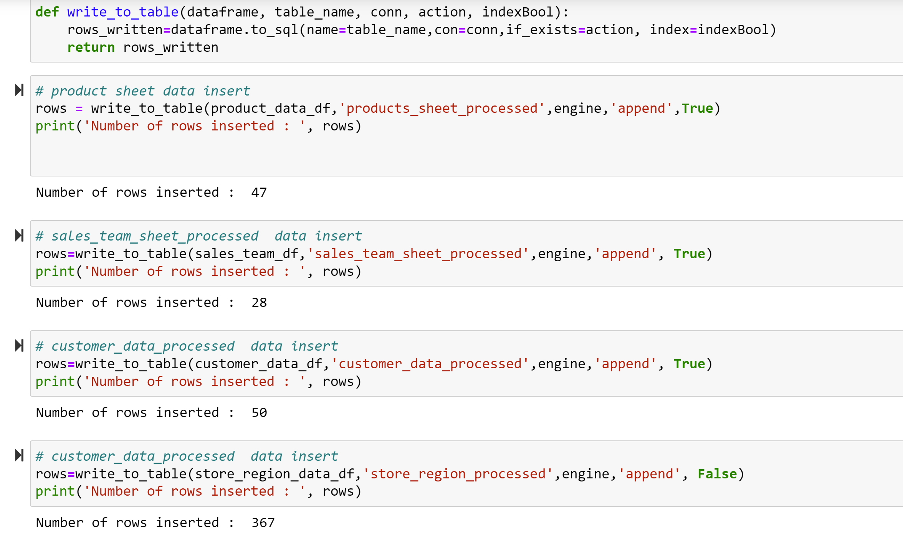

SQL_data_tableSQL_data_table# Product Sales Analysis

## Overview of the project :

 An automated end-to-end data pipeline which will perform ***"Extract***", ***Transform***" and ***Load***" the Product Sales data and then create a considerable dashbaord to visulaize the product sales statistics in Tableau. Using **Machine Learning algorithms**, classify the customer data and develope a **ML** model to predict the future sales.

 Data journey starts with downloading the files from AWS S3 bucket using ***Python*** Next dataset will undergo cleaning, filtering and transformation using Pandas. Transforemd and cleaned data will be loaded to **PostgreSQL** using sqlalchamy. Using Tableau, an interactive dashboard is built and published to Tableau server for further analysis and visulaization.
 A ML model is developed with LinearRegression Model and RandomForest Classifier model to predict the future sales. Alos, with K-means algorithom (Unsupervised learning method), customer classification is done.

***Data Sources*** : 

Data used in this project is from  https://data.world/dataman-udit/us-regional-sales-data.

This data set is a normalized in nature and contains 6 different csv files.

1. customer_data.csv
2. products_sheet.csv
3. sales_order_sheet.csv
4. sales_team_sheet.csv
5. store_location_sheet.csv
6. store_region_sheet.csv.

Reason for chosing this data is, it provides an opportunities to demosnstarte the data merging, and blending more than one data files within Python and Tableau and treat it as one single data source. 

## Steps :

1. Retrive sales related data from AWS S3 bucket. 

2. ETL - Processsing using python (Pandas, numpy).

3. Merge the Data sets in Python and blend the dataset for visulization using  Tableau.

4. Write the clean and transformed data into PostgreSQL database tables for further usage like Dashaboard & ML.

5. Create a comprehenssive  interactive dashbord using Tableau.

6. Develop Machine Learning Models:
 
   a.Using unsupervised learning methods, classify the customer data based on behaviour like Total purchased, recency and frequency.
   
   b.Develop a futre slaes prediction model with LinearRegression and RandomForest Classifier.

7. Define / Outline future enahancement for making this data pipeleine end to end automated.
 

 ## Database Schema :
 
  

## ETL :

1. Fetch data files from local filesystem or AWS S3 buckert based on config in the ETL process.

2. Validate, Clean, merge and transform 6 files.

3. Write cleaned data into csv on local f/s

4. Write the cleaned data into PostgreSQL database using Sqlalchamy

### Here are the some details below :

 #### Create the path to Local and AWS from s3 bucket.

  

#### Create conection to SQL Database :

  

#### Here all 5 CSV data loded to a SQLDatabase table detail :

  

## Machine Learning (ML) :

#### Supervised Machine Learning Model :

1. Model to predict future sales

#### Step 1: Analyze the data set.
	While analyzing the dataset, we can see May 2018 month has only 5 transactions, which is not a complete dataset and can have adverse impact on the models. Hence, orders with date May 2018 were filtered out.
We can see dataset we have is not a seasonal. So, LinearRegression and RandomForestClassifier algorithms can be used to develop a model to preddict the sales.
#### Step 2.
	Derive last 3 months sales diff for each month. Then split the data into train and test. After adding 3 months sales diff and dropping null values we end up with 28 momths data. We split first 22 months data as train dataset and remaining 6 months as test dataset.

#### Step 3: Initialze the model, fit the model and predict.

 ***Linear Regression Model***

 Here i used ***Linear Regression Model*** and ***RandomForestRegressor*** for saels pridictons.
 Below it shows two differet accuracy scores :
 
 ### Linear Regression Model :
 
  Linear Regression pridiction accuracy score is 23.63%

  
 
 ### RandomForestRegressor 
     RandomForestRegressor accuracy score is 19.9% 
     
  
 
    Here  its Shows  Linear Regression accuracy score is higher then RandomForestRegressor sales pridiction accuray score. 

## Unsupervised Machine Learning Model :

Using Machine Learning algorithms, customers can be classifiled based on the behavior like:
  1. How frequently purchased.
  2. How often customer purchased.
  3. How much the customer spent.

K-Means algorithm ( Unsupervised Learning Model) will help to learn and classify the customer data based on the behavior. Here K means clustering, which is dervied based on the Elbow curve. 
Inertia is one of the most common objective functions to use when creating an elbow curve. Basically the inertia objective function is measuring the amount of variation in the dataset. 

 

In above figure, we can see between 4,5 and 6 curve shifts to a strong horizontal line. So, for our Unsupervised ML model, we choose 4,5 & 6 as K values.

### Below figures show the customer classification using different K values:

1. K= 4

 

 

2. K= 5

 

 

3.  K= 6

 

 

## Summary : 

Using K-means algorithm, with clsuter value  6, we can see the good result with customer classification.  

## Tableau Dashboard :

Using Tableau Public, an interactive comprehenssive dashbaord is built. Dashboard is accessible here: 
In progress :
 
